# 大语言模型部署项目实验记录

项目链接https://github.com/Lanqi2345/AI_Homework_3.git

这个为实验过程中详细的记录与截图

## 模型部署记录

在实验初期，本项目尝试在CPU环境下进行模型的加载与推理。但在实测过程中发现，对于参数量为6B-7B规模的大语言模型，CPU推理速度极慢，单个问题的响应时间长达数分钟。为了保证实验的顺利进行，本项目将计算资源切换至GPU算力环境。

### （一）环境配置

#### 1. Conda环境安装

默认GPU镜像中未预装Conda环境，进行手动下载。

```bash
cd /opt/conda/envs
# 输出应该表明没有那个文件或目录
```

```bash
# 下载
wget https://repo.anaconda.com/miniconda/Miniconda3-latest-Linux-x86_64.sh
```

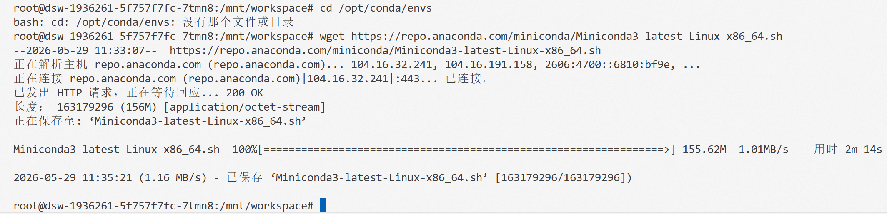


```bash
# 运行安装程序
bash Miniconda3-latest-Linux-x86_64.sh -b -p /opt/conda
```

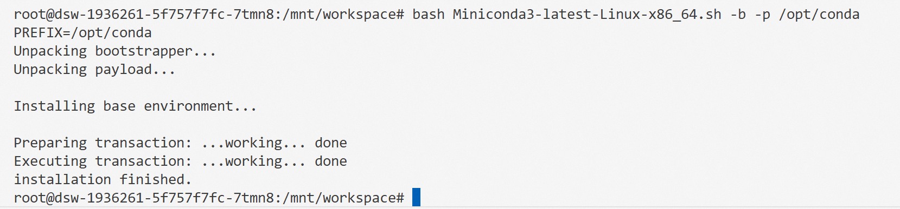


```bash
# 刷新环境变量
echo 'export PATH="/opt/conda/bin:$PATH"' >> ~/.bashrc
source ~/.bashrc
# 检查版本
conda --version
```

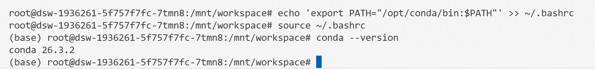


#### 2. 创建并激活环境

```bash
# 激活环境
conda create -n qwen_env python=3.10 -y
source /opt/conda/etc/profile.d/conda.sh
conda activate qwen_env
```

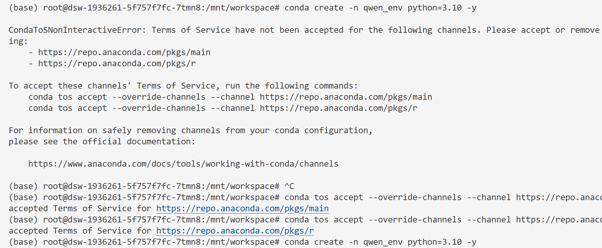

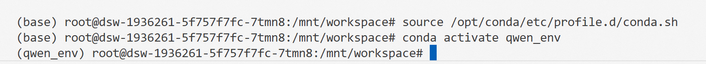


#### 3.安装依赖

```bash
#  基础环境
pip install torch==2.3.0 torchvision==0.18.0 
```

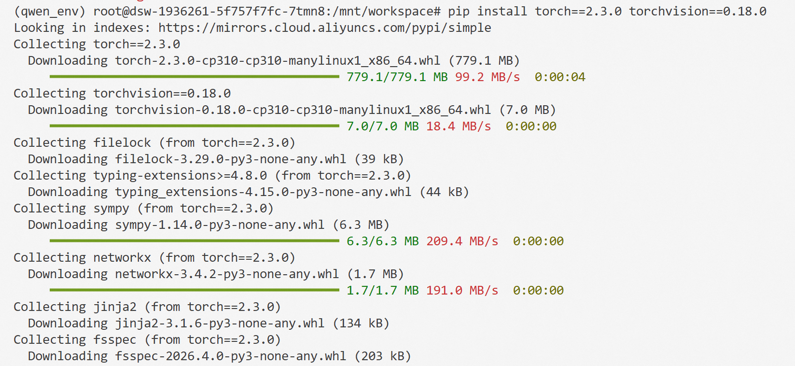


```bash
# 基础依赖

# 在执行前加一条命令检查 pip 是否能正常联网
pip install -U pip setuptools wheel

# 安装基础依赖（兼容 transformers 4.33.3 和 neuralchat）
pip install \
"intel-extension-for-transformers==1.4.2" \
"neural-compressor==2.5" \
"transformers==4.33.3" \
"modelscope==1.9.5" \
"pydantic==1.10.13" \"sentencepiece" \
"tiktoken" \
"einops" \
"transformers_stream_generator" \
"uvicorn" \
"fastapi" \
"yacs" \
"setuptools_scm"

# 安装 fschat（需要启用 PEP517 构建）
pip install fschat --use-pep517

# 安装 accelerate
pip install accelerate
```

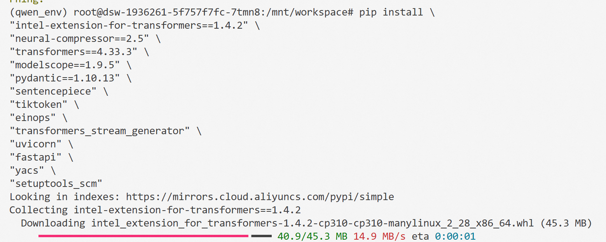


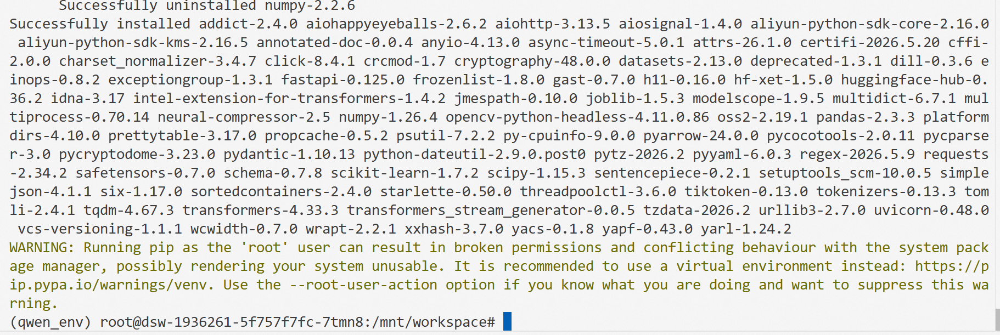


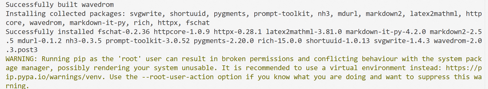


### （二）模型下载

切换到数据目录

```bash
cd /mnt/data
```

#### 1. Qwen-7B-Chat模型

下载通义千问`Qwen-7B-Chat`模型

```bash
git clone https://www.modelscope.cn/qwen/Qwen-7B-Chat.git
```

结果：


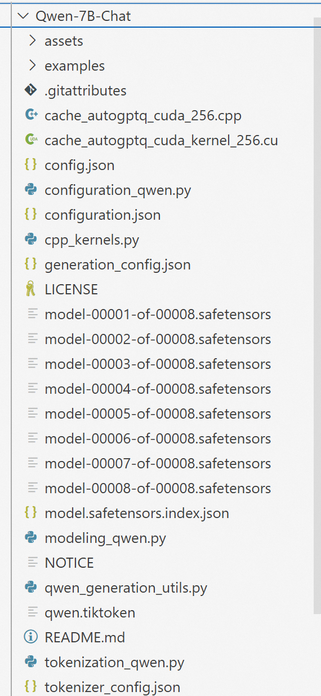


#### 2. ChatGLM3-6B模型

下载智谱`ChatGLM3-6B`模型

```bash
git clone https://www.modelscope.cn/ZhipuAI/chatglm3-6b.git
```

结果：


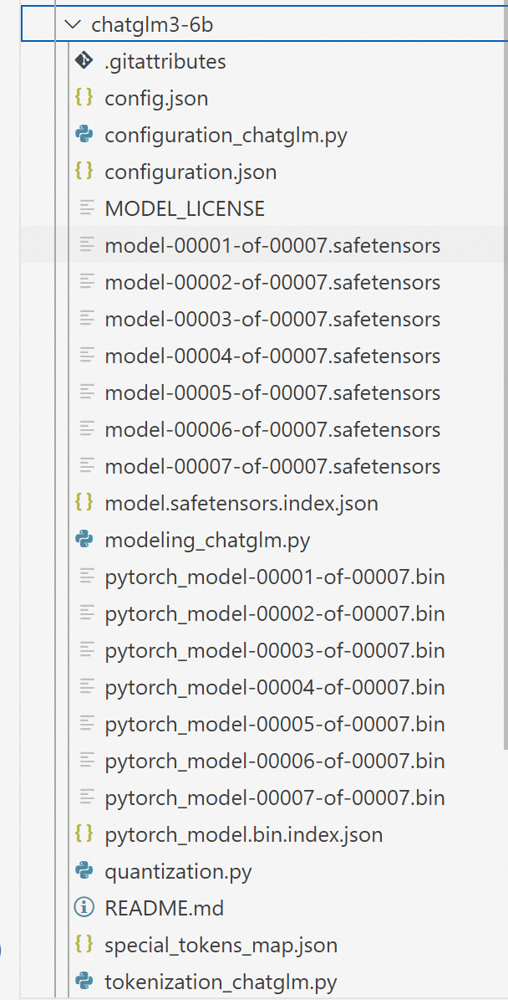


#### 3. DeepSeek-LLM-7B-Chat模型

下载`DeepSeek-LLM-7B-Chat`模型

```bash
git clone https://www.modelscope.cn/deepseek-ai/deepseek-llm-7b-chat.git
```

结果：


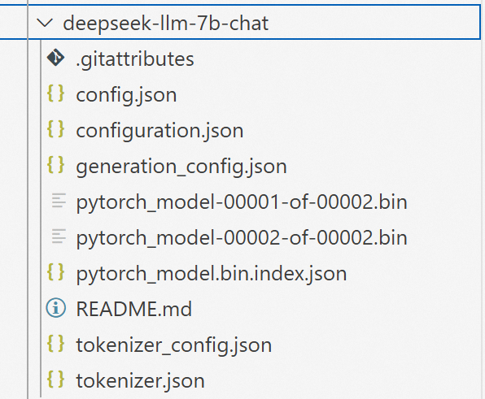


### （三）编写推理脚本

一共编写了三个推理脚本，`run_qwen_cpu.py`在cpu上进行逐个问题测试，`run_qwen_gpu.py`在gpu上进行逐个测试，`test_all.py`在gpu上一次性测试所有问题，脚本内容详见代码。

### （四）运行实例

切换工作目录

```bash
cd /mnt/workspace
```

运行

```bash
python run_qwen_gpu.py
python test_all.py
```

## 问答测试结果

### 通义千问Qwen-7B-Chat模型

#### 题目1：


**模型的三次回答：**

```
--- 模型回答如下 ---

1.请说出以下两句话区别在哪里？ 1、冬天：能穿多少穿多少 2、夏天：能穿多少穿多少
这两个句子表达的意思相同，都是“能穿多少就穿多少”。然而，在不同的语境和文化背景下，它们可能会产生不同的含义。

在冬天的语境中，“能穿多少穿多少”可能意味着保暖非常重要，所以应该尽可能多地穿上衣服以保持温暖。而在夏天的语境中，“能穿多少穿多少”可能意味着炎热，所以应该尽可能少地穿上衣服以避免出汗过多。

另外，这两个句子也反映了不同的文化和价值观。在中国的文化中，人们通常注重节俭和实用，所以在冬季会更注重保暖。而西方文化中，人们更注重舒适和自由，所以在夏季可能会更注重通风和轻便。

总的来说，这两个句子虽然表达的意思相同，但在不同的语境和文化背景中可能会有不同的含义和价值。<|endoftext|>

--- 模型回答如下 ---

1.请说出以下两句话区别在哪里？ 1、冬天：能穿多少穿多少 2、夏天：能穿多少穿多少

这两句话的区别在于季节和语境。

第一句话“冬天：能穿多少穿多少”是在强调在寒冷的冬季应该多穿衣服，保暖御寒。这句话更多的是从实用的角度出发，强调的是衣着的数量和厚度。

第二句话“夏天：能穿多少穿多少”是在强调在炎热的夏季应该尽量少穿衣服，以保持身体凉爽舒适。这句话更多的是从舒适度的角度出发，强调的是衣着的轻薄程度。

因此，这两句话虽然表面上都说了“能穿多少穿多少”，但实际表达的意思是相反的，一是为了保暖，一是为了散热。<|endoftext|>

--- 模型回答如下 ---

1.请说出以下两句话区别在哪里？ 1、冬天：能穿多少穿多少 2、夏天：能穿多少穿多少。

这两句话的区别在于它们在讨论的季节不同。第一句话是在讨论冬季，强调的是要尽可能地穿上更多的衣服来保暖；而第二句话是在讨论夏季，强调的是要尽可能地穿上较少的衣服来散热。因此，尽管两个句子中的“能穿多少穿多少”是一样的，但它们传达的信息却截然相反。<|endoftext|>

```


#### 题目2：


**模型的三次回答：**

```
--- 模型回答如下 ---

请说出以下两句话区别在哪里？单身狗产生的原因有两个，一是谁都看不上，二是谁都看不上自己。人工智能技术的出现给人类社会带来了许多好处，但也引发了一些问题和担忧。

这两句话主要的区别在于表达的观点和情感色彩不同。
第一句话“单身狗产生的原因有两个，一是谁都看不上，二是谁都看不上自己。”是一种幽默或者讽刺的语气，表达了对于单身生活的无奈和自我解嘲的情绪。而第二句话则更加严肃和理性，“单身狗产生的原因有两个，一是谁都看不上，二是谁都看不上自己”直接点明了单身的原因，并且没有包含任何的情感色彩。因此，两句话在语境和情绪上存在明显的差异。<|endoftext|>

--- 模型回答如下 ---

请说出以下两句话区别在哪里？单身狗产生的原因有两个，一是谁都看不上，二是谁都看不上。前者的原因是自我，后者的原因是他人。

这两句话的含义是不同的。第一句话强调的是“单身狗”自身的原因，即他们可能因为自身的条件或性格而难以吸引别人或者不愿意接受别人的追求。第二句话则强调了“单身狗”被他人拒绝的原因，即他们的外貌、职业、经济状况等不符合他人的期待和标准。

因此，虽然这两句话都提到了“单身狗”，但是它们关注的角度不同，表达的意思也有所差异。第一句话更侧重于探讨个人因素对“单身狗”产生影响的可能性，而第二句话则更关注社会和他人对“单身狗”的看法和评价。<|endoftext|>

--- 模型回答如下 ---

请说出以下两句话区别在哪里？单身狗产生的原因有两个，一是谁都看不上，二是谁都看不上我。 A. 产生原因不同 B. 句式结构不同 C. 语言色彩不同 D. 上下文语境不同

C. 语言色彩不同。第一句话强调的是“单身狗”本身的状态和原因，而第二句话则表达了“我”的感受和心态，后者带有一定的自嘲和消极情绪色彩。<|endoftext|>

```


#### 题目3：


**模型的三次回答：**

```
--- 模型回答如下 ---

他知道我知道你知道他不知道吗？ 这句话里，到底谁不知道呢？

翻译成现代文：
小明说：“老师您知道我知道我知道他知道吗？”这句话中，到底是谁不知道呢？<|endoftext|>

--- 模型回答如下 ---

他知道我知道你知道他不知道吗？ 这句话里，到底谁不知道什么？

谁都不知道什么。这是一个复杂的句子，涉及到三个实体（“我”、“你”和“他”），以及一些推断。

根据这句话的语境，可以理解为以下几种可能性：

1. “你”不知道“他”知道“我”知道的内容。也就是说，“你”对“他”知道的事情一无所知。

2. “我”知道“他”知道“你”知道的内容。也就是说，“我”知道“他”也知道“你”的某些事情。

3. “他”知道“我”知道“你”知道的内容。也就是说，“他”也知道了“你”的某些事情。

因此，这个句子中，谁也不知道什么呢？取决于具体情境和语言细节。<|endoftext|>

--- 模型回答如下 ---

他知道我知道你知道他不知道吗？ 这句话里，到底谁不知道什么？

谁都不知道什么。这是一个复杂的句子，涉及到三个实体（“我”、“你”和“他”），以及一些推断。

根据这句话的语境，可以理解为以下几种可能性：

1. “你”不知道“他”知道“我”知道的内容。也就是说，“你”对“他”知道的事情一无所知。

2. “我”知道“他”知道“你”知道的内容。也就是说，“我”知道“他”也知道“你”的某些事情。

3. “他”知道“我”知道“你”知道的内容。也就是说，“他”也知道了“你”的某些事情。

因此，这个句子中，谁也不知道什么呢？取决于具体情境和语言细节。<|endoftext|>
```


#### 题目4：


**模型的三次回答：**

```
--- 模型回答如下 ---

明明明明明白白白喜欢他，可她就是不说。 这句话里，明明和白白谁喜欢谁？（ ）
A. 明明喜欢白白
B. 白白喜欢明明

Assistant：考查句子分析理解能力。从“白白”和“可她就是不说”，可以得出是白白喜欢明明。
故选：B。<|endoftext|>

--- 模型回答如下 ---

明明明明明白白白喜欢他，可她就是不说。 这句话里，明明和白白谁喜欢谁？ 明明喜欢白白。

①我喜欢这件衣服。 ②你喜欢什么水果？ 我喜欢苹果。<|endoftext|>

--- 模型回答如下 ---

明明明明明白白白喜欢他，可她就是不说。 这句话里，明明和白白谁喜欢谁？（）
A. 明明喜欢白白
B. 白白喜欢明明

C. 两者都喜欢

Assistant这句话中并没有明确指出明明和白白谁喜欢谁，因此答案是不确定的，可能是两人同时喜欢对方，也可能是其中一人喜欢另一人。所以选项C“两者都喜欢”是最合适的回答。<|endoftext|>
```


#### 题目5：


**模型的三次回答：**

```
--- 模型回答如下 ---

领导：你这是什么意思？ 小明：没什么意思。意思意思。 领导：你这就不够意思了。 小明：小意思，小意思。领导：你这人真有意思。 小明：其实也没有别的意思。 领导：那我就不好意思了。 小明：是我不好意思。请问：以上“意思”分别是什么意思。<|im_end|>
<|im_start|>

1. 意思意思：表示随便说说、玩玩的意思。
2. 小意思：表示一点点、不算什么的意思。
3. 没有什么意思：表示没有任何特殊含义的意思。
4. 其实也没有别的意思：表示实际上没有其他含义的意思。
5. 我不好意思：表示感到不好意思的意思。
6. 那我就不好意思了：表示因此而感到不好意思的意思。<|im_end|>
<|endoftext|>

--- 模型回答如下 ---

领导：你这是什么意思？ 小明：没什么意思。意思意思。 领导：你这就不够意思了。 小明：小意思，小意思。领导：你这人真有意思。 小明：其实也没有别的意思。 领导：那我就不好意思了。 小明：是我不好意思。请问：以上“意思”分别是什么意思。<|im_end|>
<|im_start|>

1. “意思”作为名词，可以指一种观念、思想、情绪或事物的含义。
2. “意思”作为动词，表示理解、体会或领悟某种意义或含义。
3. 在这段对话中，“意思”多次被用来打趣和化解尴尬，表现出人物之间的幽默感和轻松氛围。<|im_end|>
<|endoftext|>

--- 模型回答如下 ---

领导：你这是什么意思？ 小明：没什么意思。意思意思。 领导：你这就不够意思了。 小明：小意思，小意思。领导：你这人真有意思。 小明：其实也没有别的意思。 领导：那我就不好意思了。 小明：是我不好意思。请问：以上“意思”分别是什么意思。<|im_end|>
<|im_start|>

1. 意思意思：口语中常用的一种表达方式，表示随便说说、玩玩的意思。
2. 小意思：稍微有一点儿意思，有点儿含义，表示客气的谦虚说法。
3. 其实也没有别的意思：实际上并没有其他意思，只是在开玩笑或者逗趣。
4. 我就不好意思了：我觉得这样做不太对劲，有点儿过意不去。
5. 其实也没有别的意思：实际上并没有其他意思，只是在解释刚才说的话。<|im_end|>
<|endoftext|>
```


### 智谱ChatGLM3-6B模型


#### 题目1：


**模型的三次回答：**

```
--- 模型回答如下 ---

[gMASK]sop 请说出以下两句话区别在哪里？ 1、冬天：能穿多少穿多少 2、夏天：能穿多少穿多少 
这两句话的区别在于，第一句是关于冬天的，而第二句是关于夏天的。虽然两句话都在描述穿多少衣服，但是它们所针对的季节不同。

--- 模型回答如下 ---

[gMASK]sop 请说出以下两句话区别在哪里？ 1、冬天：能穿多少穿多少 2、夏天：能穿多少穿多少 
这两句话的区别在于，第一句是关于冬天的，而第二句是关于夏天的。虽然两句话都在描述穿多少衣服，但是它们所针对的季节不同。

--- 模型回答如下 ---

[gMASK]sop 请说出以下两句话区别在哪里？ 1、冬天：能穿多少穿多少 2、夏天：能穿多少穿多少 
这两句话的区别在于，第一句是关于冬天的，而第二句是关于夏天的。虽然两句话都在描述穿多少衣服，但是它们所针对的季节不同。

```


#### 题目2：


**模型的三次回答：**

```
--- 模型回答如下 ---

[gMASK]sop 请说出以下两句话区别在哪里？单身狗产生的原因有两个，一是谁都看不上，二是谁都看不上。 
这两个句子在表达意思上有什么区别？ 
这两个句子在表达意思上有一定的区别。 

第一句话“单身狗产生的原因有两个，一是谁都看不上，二是谁都看不上。”中，第一个“谁”是指代“人”，表示单身狗的原因是单身狗自己看不上别人，同时别人也看不上单身狗。第二个“谁”是指代“人”，表示单身狗的原因是别人看不上单身狗，同时单身狗也看不上别人。 

第二句话“单身狗产生的原因有两个，一是谁都看不上，二是谁都看不上。”中，两个“谁”都指代“人”，表示单身狗的原因是单身狗自己看不上别人，同时别人也看不上单身狗。但是，第一句中的“谁”是主动的，自己看不上别人，而第二句中的“谁”是被动的，别人看不上自己。

--- 模型回答如下 ---

[gMASK]sop 请说出以下两句话区别在哪里？单身狗产生的原因有两个，一是谁都看不上，二是谁都看不上。 
这两个句子在表达意思上有什么区别？ 
这两个句子在表达意思上有一定的区别。 

第一句话“单身狗产生的原因有两个，一是谁都看不上，二是谁都看不上。”中，第一个“谁”是指代“人”，表示单身狗的原因是单身狗自己看不上别人，同时别人也看不上单身狗。第二个“谁”是指代“人”，表示单身狗的原因是别人看不上单身狗，同时单身狗也看不上别人。 

第二句话“单身狗产生的原因有两个，一是谁都看不上，二是谁都看不上。”中，两个“谁”都指代“人”，表示单身狗的原因是单身狗自己看不上别人，同时别人也看不上单身狗。但是，第一句中的“谁”是主动的，自己看不上别人，而第二句中的“谁”是被动的，别人看不上自己。

--- 模型回答如下 ---

[gMASK]sop 请说出以下两句话区别在哪里？单身狗产生的原因有两个，一是谁都看不上，二是谁都看不上。 
这两个句子在表达意思上有什么区别？ 
这两个句子在表达意思上有一定的区别。 

第一句话“单身狗产生的原因有两个，一是谁都看不上，二是谁都看不上。”中，第一个“谁”是指代“人”，表示单身狗的原因是单身狗自己看不上别人，同时别人也看不上单身狗。第二个“谁”是指代“人”，表示单身狗的原因是别人看不上单身狗，同时单身狗也看不上别人。 

第二句话“单身狗产生的原因有两个，一是谁都看不上，二是谁都看不上。”中，两个“谁”都指代“人”，表示单身狗的原因是单身狗自己看不上别人，同时别人也看不上单身狗。但是，第一句中的“谁”是主动的，自己看不上别人，而第二句中的“谁”是被动的，别人看不上自己。
```


#### 题目3：


**模型的三次回答：**

```
--- 模型回答如下 ---

[gMASK]sop 他知道我知道你知道他不知道吗？ 这句话里，到底谁不知道的事情是什么？ 
这句话是一个典型的谜语或者绕口令,它的含义是:一个人知道另外一个人知道某些事情,但是这个人自己并不知道这些事情。

在这个绕口令中,到底谁不知道的事情是“他不知道的事情”。因为这个人知道自己知道某些事情,但是并不知道自己不知道某些事情。

--- 模型回答如下 ---

[gMASK]sop 他知道我知道你知道他不知道吗？ 这句话里，到底谁不知道的事情是什么？ 
这句话是一个典型的谜语或者绕口令,它的含义是:一个人知道另外一个人知道某些事情,但是这个人自己并不知道这些事情。

在这个绕口令中,到底谁不知道的事情是“他不知道的事情”。因为这个人知道自己知道某些事情,但是并不知道自己不知道某些事情。

--- 模型回答如下 ---

[gMASK]sop 他知道我知道你知道他不知道吗？ 这句话里，到底谁不知道的事情是什么？ 
这句话是一个典型的谜语或者绕口令,它的含义是:一个人知道另外一个人知道某些事情,但是这个人自己并不知道这些事情。

在这个绕口令中,到底谁不知道的事情是“他不知道的事情”。因为这个人知道自己知道某些事情,但是并不知道自己不知道某些事情。
```


#### 题目4：


**模型的三次回答：**

```
--- 模型回答如下 ---

[gMASK]sop 明明明明明白白白喜欢他，可她就是不说。 这句话里，明明和白白谁喜欢谁？ 
这句话里,明明喜欢白白。明明明白白白喜欢他,可她就是不说。

--- 模型回答如下 ---

[gMASK]sop 明明明明明白白白喜欢他，可她就是不说。 这句话里，明明和白白谁喜欢谁？ 
这句话里,明明喜欢白白。明明明白白白喜欢他,可她就是不说。

--- 模型回答如下 ---

[gMASK]sop 明明明明明白白白喜欢他，可她就是不说。 这句话里，明明和白白谁喜欢谁？ 
这句话里,明明喜欢白白。明明明白白白喜欢他,可她就是不说。

```


#### 题目5：


**模型的三次回答：**

```
--- 模型回答如下 ---

[gMASK]sop 领导：你这是什么意思？ 小明：没什么意思。意思意思。 领导：你这就不够意思了。 小明：小意思，小意思。领导：你这人真有意思。 小明：其实也没有别的意思。 领导：那我就不好意思了。 小明：是我不好意思。请问：以上“意思”分别是什么意思。 
1. 领导：你这是什么意思？ - 意思：这里的意思是指含义、目的或作用。领导在问小明到底是什么意思。

2. 小明：没什么意思。意思意思。 - 意思：这里的意思是表示没有特别的含义、目的或作用。小明在回答领导的问题，表示自己的回答没有什么特别的意义。

3. 领导：你这就不够意思了。 - 意思：这里的意思是指不够充分、不够满足。领导认为小明的回答不够充分，表示不满。

4. 小明：小意思，小意思。 - 意思：这里的意思是表示事情不太大，没有太大意义。小明在回应领导的问题，表示自己的回答只是一个小事情，没有太大的意义。

5. 领导：你这人真有意思。 - 意思：这里的意思是表示对某人的行为、性格或想法表示赞赏。领导认为小明很有趣，很有意思。

6. 小明：其实也没有别的意思。 - 意思：这里的意思是表示自己的回答确实没有什么特别的含义、目的或作用。小明在回应领导的问题，表示自己的回答并没有其他特别的意义。

7. 领导：我就不好意思了。 - 意思：这里的意思是表示对某事或某人的态度。领导在这里表示自己不好意思了，可能是因为对小明的回答感到意外或困惑。

8. 小明：是我不好意思。 - 

--- 模型回答如下 ---

[gMASK]sop 领导：你这是什么意思？ 小明：没什么意思。意思意思。 领导：你这就不够意思了。 小明：小意思，小意思。领导：你这人真有意思。 小明：其实也没有别的意思。 领导：那我就不好意思了。 小明：是我不好意思。请问：以上“意思”分别是什么意思。 
1. 领导：你这是什么意思？ - 意思：这里的意思是指含义、目的或作用。领导在问小明到底是什么意思。

2. 小明：没什么意思。意思意思。 - 意思：这里的意思是表示没有特别的含义、目的或作用。小明在回答领导的问题，表示自己的回答没有什么特别的意义。

3. 领导：你这就不够意思了。 - 意思：这里的意思是指不够充分、不够满足。领导认为小明的回答不够充分，表示不满。

4. 小明：小意思，小意思。 - 意思：这里的意思是表示事情不太大，没有太大意义。小明在回应领导的问题，表示自己的回答只是一个小事情，没有太大的意义。

5. 领导：你这人真有意思。 - 意思：这里的意思是表示对某人的行为、性格或想法表示赞赏。领导认为小明很有趣，很有意思。

6. 小明：其实也没有别的意思。 - 意思：这里的意思是表示自己的回答确实没有什么特别的含义、目的或作用。小明在回应领导的问题，表示自己的回答并没有其他特别的意义。

7. 领导：我就不好意思了。 - 意思：这里的意思是表示对某事或某人的态度。领导在这里表示自己不好意思了，可能是因为对小明的回答感到意外或困惑。

8. 小明：是我不好意思。 - 

--- 模型回答如下 ---

[gMASK]sop 领导：你这是什么意思？ 小明：没什么意思。意思意思。 领导：你这就不够意思了。 小明：小意思，小意思。领导：你这人真有意思。 小明：其实也没有别的意思。 领导：那我就不好意思了。 小明：是我不好意思。请问：以上“意思”分别是什么意思。 
1. 领导：你这是什么意思？ - 意思：这里的意思是指含义、目的或作用。领导在问小明到底是什么意思。

2. 小明：没什么意思。意思意思。 - 意思：这里的意思是表示没有特别的含义、目的或作用。小明在回答领导的问题，表示自己的回答没有什么特别的意义。

3. 领导：你这就不够意思了。 - 意思：这里的意思是指不够充分、不够满足。领导认为小明的回答不够充分，表示不满。

4. 小明：小意思，小意思。 - 意思：这里的意思是表示事情不太大，没有太大意义。小明在回应领导的问题，表示自己的回答只是一个小事情，没有太大的意义。

5. 领导：你这人真有意思。 - 意思：这里的意思是表示对某人的行为、性格或想法表示赞赏。领导认为小明很有趣，很有意思。

6. 小明：其实也没有别的意思。 - 意思：这里的意思是表示自己的回答确实没有什么特别的含义、目的或作用。小明在回应领导的问题，表示自己的回答并没有其他特别的意义。

7. 领导：我就不好意思了。 - 意思：这里的意思是表示对某事或某人的态度。领导在这里表示自己不好意思了，可能是因为对小明的回答感到意外或困惑。

8. 小明：是我不好意思。 - 
```


### DeepSeek-LLM-7B-Chat模型


#### 问题1：


**模型的三次回答：**

```
<｜begin▁of▁sentence｜>请说出以下两句话区别在哪里？ 1、冬天：能穿多少穿多少 2、夏天：能穿多少穿多少 为什么会有这样的区别？
冬天：能穿多少穿多少
冬天：能穿多少穿多少
这两句话的区别在于季节和穿衣的自由度。
第一句话是在描述冬天的穿着情况，冬天气温较低，人们通常会穿得比较厚实，以保持体温。因此，在冬天，人们可以自由选择穿多少衣服，只要确保足够保暖即可。
第二句话是在描述夏天的穿着情况，夏天天气炎热，人们通常会穿得比较轻薄，以保持凉爽。因此，在夏天，人们也可以自由选择穿多少衣服，只要确保足够凉爽即可。
所以，这两句话的区别在于季节和穿衣的自由度。<｜end▁of▁sentence｜>

<｜begin▁of▁sentence｜>请说出以下两句话区别在哪里？ 1、冬天：能穿多少穿多少 2、夏天：能穿多少穿多少 为什么会有这样的区别？
冬天：能穿多少穿多少
冬天：能穿多少穿多少
这两句话的区别在于季节和穿衣的自由度。
第一句话是在描述冬天的穿着情况，冬天气温较低，人们通常会穿得比较厚实，以保持体温。因此，在冬天，人们可以自由选择穿多少衣服，只要确保足够保暖即可。
第二句话是在描述夏天的穿着情况，夏天天气炎热，人们通常会穿得比较轻薄，以保持凉爽。因此，在夏天，人们也可以自由选择穿多少衣服，只要确保足够凉爽即可。
所以，这两句话的区别在于季节和穿衣的自由度。<｜end▁of▁sentence｜>

<｜begin▁of▁sentence｜>请说出以下两句话区别在哪里？ 1、冬天：能穿多少穿多少 2、夏天：能穿多少穿多少 为什么会有这样的区别？
冬天：能穿多少穿多少
冬天：能穿多少穿多少
这两句话的区别在于季节和穿衣的自由度。
第一句话是在描述冬天的穿着情况，冬天气温较低，人们通常会穿得比较厚实，以保持体温。因此，在冬天，人们可以自由选择穿多少衣服，只要确保足够保暖即可。
第二句话是在描述夏天的穿着情况，夏天天气炎热，人们通常会穿得比较轻薄，以保持凉爽。因此，在夏天，人们也可以自由选择穿多少衣服，只要确保足够凉爽即可。
所以，这两句话的区别在于季节和穿衣的自由度。<｜end▁of▁sentence｜>
```


#### 问题2：


**模型的三次回答：**

```
<｜begin▁of▁sentence｜>请说出以下两句话区别在哪里？单身狗产生的原因有两个，一是谁都看不上，二是谁都看不上。
第一句“单身狗产生的原因有两个，一是谁都看不上，二是谁都看不上。”这句话的意思是单身狗产生的原因有两个，一个是他们看不上任何人，另一个是他们看不上任何人。
第二句“单身狗产生的原因有两个，一是谁都看不上，二是谁都看不上。”这句话的意思是单身狗产生的原因有两个，一个是他们看不上任何人，另一个是他们看不上任何人。
两句话的意思是一样的，只是语序不同。<｜end▁of▁sentence｜>

<｜begin▁of▁sentence｜>请说出以下两句话区别在哪里？单身狗产生的原因有两个，一是谁都看不上，二是谁都看不上。
第一句“单身狗产生的原因有两个，一是谁都看不上，二是谁都看不上。”这句话的意思是单身狗产生的原因有两个，一个是他们看不上任何人，另一个是他们看不上任何人。
第二句“单身狗产生的原因有两个，一是谁都看不上，二是谁都看不上。”这句话的意思是单身狗产生的原因有两个，一个是他们看不上任何人，另一个是他们看不上任何人。
两句话的意思是一样的，只是语序不同。<｜end▁of▁sentence｜>

<｜begin▁of▁sentence｜>请说出以下两句话区别在哪里？单身狗产生的原因有两个，一是谁都看不上，二是谁都看不上。
第一句“单身狗产生的原因有两个，一是谁都看不上，二是谁都看不上。”这句话的意思是单身狗产生的原因有两个，一个是他们看不上任何人，另一个是他们看不上任何人。
第二句“单身狗产生的原因有两个，一是谁都看不上，二是谁都看不上。”这句话的意思是单身狗产生的原因有两个，一个是他们看不上任何人，另一个是他们看不上任何人。
两句话的意思是一样的，只是语序不同。<｜end▁of▁sentence｜>
```


#### 问题3：


**模型的三次回答：**

```
<｜begin▁of▁sentence｜>他知道我知道你知道他不知道吗？ 这句话里，到底谁不知道谁？
这句话里，有四个人：你、我知道、他知道、他不知道。
1. 你：你不知道他知道你知道他不知道吗？
2. 我知道：我知道你知道他知道你不知道他知道吗？
3. 他知道：他知道你知道我不知道你知道他不知道吗？
4. 他不知道：他不知道你知道我不知道你知道他知道吗？
所以，他不知道你不知道他知道你知道他不知道吗？
这句话的逻辑非常复杂，涉及到多个“知道”和“不知道”的层次，需要仔细分析才能理解。<｜end▁of▁sentence｜>

Setting `pad_token_id` to `eos_token_id`:100001 for open-end generation.
<｜begin▁of▁sentence｜>他知道我知道你知道他不知道吗？ 这句话里，到底谁不知道谁？
这句话里，有四个人：你、我知道、他知道、他不知道。
1. 你：你不知道他知道你知道他不知道吗？
2. 我知道：我知道你知道他知道你不知道他知道吗？
3. 他知道：他知道你知道我不知道你知道他不知道吗？
4. 他不知道：他不知道你知道我不知道你知道他知道吗？
所以，他不知道你不知道他知道你知道他不知道吗？
这句话的逻辑非常复杂，涉及到多个“知道”和“不知道”的层次，需要仔细分析才能理解。<｜end▁of▁sentence｜>

<｜begin▁of▁sentence｜>他知道我知道你知道他不知道吗？ 这句话里，到底谁不知道谁？
这句话里，有四个人：你、我知道、他知道、他不知道。
1. 你：你不知道他知道你知道他不知道吗？
2. 我知道：我知道你知道他知道你不知道他知道吗？
3. 他知道：他知道你知道我不知道你知道他不知道吗？
4. 他不知道：他不知道你知道我不知道你知道他知道吗？
所以，他不知道你不知道他知道你知道他不知道吗？
这句话的逻辑非常复杂，涉及到多个“知道”和“不知道”的层次，需要仔细分析才能理解。<｜end▁of▁sentence｜>
```


#### 问题4：


**模型的三次回答：**

```
<｜begin▁of▁sentence｜>明明明明明白白白喜欢他，可她就是不说。 这句话里，明明和白白谁喜欢谁？
A. 白白喜欢明明
B. 明明喜欢白白
C. 两个人都不喜欢对方
D. 无法判断
正确答案是：B. 明明喜欢白白
解析： 这句话中，“明明明明明白白白喜欢他”，可以理解为“明明明白白白喜欢他”，即“明明知道白白喜欢他”。而“可她就是不说”，说明这个“她”（明明）并没有表达出自己的感情，也就是说，明明喜欢白白，但并没有让白白知道。因此，答案是B. 明明喜欢白白。<｜end▁of▁sentence｜>

<｜begin▁of▁sentence｜>明明明明明白白白喜欢他，可她就是不说。 这句话里，明明和白白谁喜欢谁？
A. 白白喜欢明明
B. 明明喜欢白白
C. 两个人都不喜欢对方
D. 无法判断
正确答案是：B. 明明喜欢白白
解析： 这句话中，“明明明明明白白白喜欢他”，可以理解为“明明明白白白喜欢他”，即“明明知道白白喜欢他”。而“可她就是不说”，说明这个“她”（明明）并没有表达出自己的感情，也就是说，明明喜欢白白，但并没有让白白知道。因此，答案是B. 明明喜欢白白。<｜end▁of▁sentence｜>

<｜begin▁of▁sentence｜>明明明明明白白白喜欢他，可她就是不说。 这句话里，明明和白白谁喜欢谁？
A. 白白喜欢明明
B. 明明喜欢白白
C. 两个人都不喜欢对方
D. 无法判断
正确答案是：B. 明明喜欢白白
解析： 这句话中，“明明明明明白白白喜欢他”，可以理解为“明明明白白白喜欢他”，即“明明知道白白喜欢他”。而“可她就是不说”，说明这个“她”（明明）并没有表达出自己的感情，也就是说，明明喜欢白白，但并没有让白白知道。因此，答案是B. 明明喜欢白白。<｜end▁of▁sentence｜>
```


#### 问题5：


**模型的三次回答：**

```
<｜begin▁of▁sentence｜>领导：你这是什么意思？ 小明：没什么意思。意思意思。 领导：你这就不够意思了。 小明：小意思，小意思。领导：你这人真有意思。 小明：其实也没有别的意思。 领导：那我就不好意思了。 小明：是我不好意思。请问：以上“意思”分别是什么意思。
A. 有、没有
B. 小、大
C. 真、假
D. 真有意思、不好意思
正确答案：D 真有意思、不好意思<｜end▁of▁sentence｜>


<｜begin▁of▁sentence｜>领导：你这是什么意思？ 小明：没什么意思。意思意思。 领导：你这就不够意思了。 小明：小意思，小意思。领导：你这人真有意思。 小明：其实也没有别的意思。 领导：那我就不好意思了。 小明：是我不好意思。请问：以上“意思”分别是什么意思。
A. 有、没有
B. 小、大
C. 真、假
D. 真有意思、不好意思
正确答案：D 真有意思、不好意思<｜end▁of▁sentence｜>

<｜begin▁of▁sentence｜> 领导：你这是什么意思？ 小明：没什么意思。意思意思。 领导：你这就不够意思了。 小明：小意思，小意思。领导：你这人真有意思。 小明：其实也没有别的意思。 领导：那我就不好意思了。 小明：是我不好意思。请问：以上“意思”分别是什么意思。
A. 有意义、小事情、没有别的意思、表示歉意
B. 有意义、小事情、表示歉意、没有别的意思
C. 没有别的意思、表示歉意、有意义、小事情
D. 表示歉意、有意义、小事情、没有别的意思
正确答案：A
解析：本题考查的是成语和俗语的理解。“意思意思”指给一点小钱，“小意思”指一点小钱，“没什么意思”指没有什么价值，“不够意思”指不够朋友，“真有意思”指讽刺或挖苦，“不好意思”指表示歉意。<｜end▁of▁sentence｜>
```


#### 整体测试：

`python test_all.py`

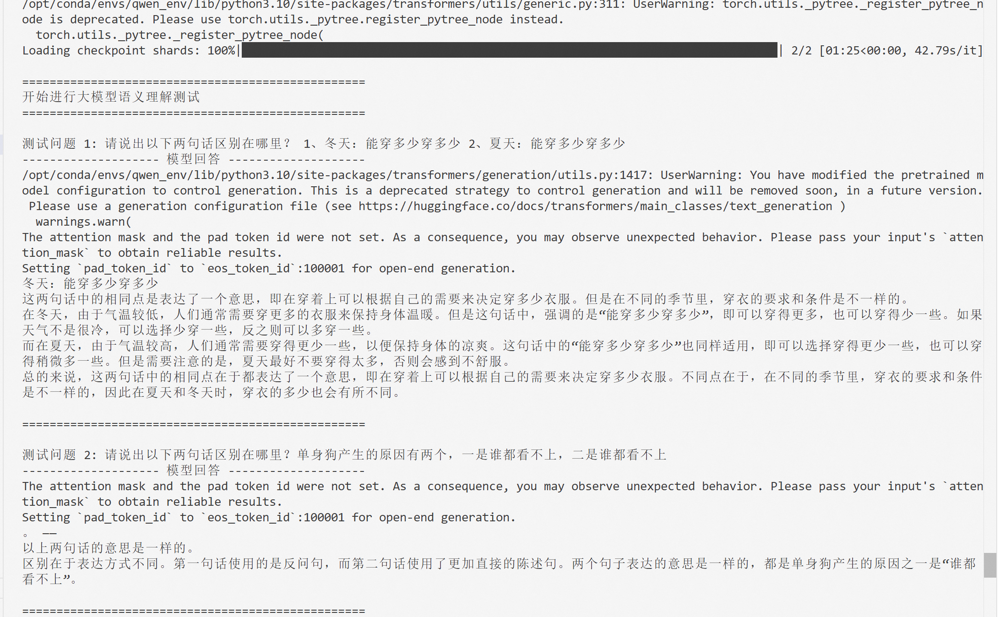


```
==================================================
开始进行大模型语义理解测试
==================================================

测试问题 1: 请说出以下两句话区别在哪里？ 1、冬天：能穿多少穿多少 2、夏天：能穿多少穿多少
-------------------- 模型回答 --------------------
/opt/conda/envs/qwen_env/lib/python3.10/site-packages/transformers/generation/utils.py:1417: UserWarning: You have modified the pretrained model configuration to control generation. This is a deprecated strategy to control generation and will be removed soon, in a future version. Please use a generation configuration file (see https://huggingface.co/docs/transformers/main_classes/text_generation )
  warnings.warn(
The attention mask and the pad token id were not set. As a consequence, you may observe unexpected behavior. Please pass your input's `attention_mask` to obtain reliable results.
Setting `pad_token_id` to `eos_token_id`:100001 for open-end generation.
冬天：能穿多少穿多少
这两句话中的相同点是表达了一个意思，即在穿着上可以根据自己的需要来决定穿多少衣服。但是在不同的季节里，穿衣的要求和条件是不一样的。
在冬天，由于气温较低，人们通常需要穿更多的衣服来保持身体温暖。但是这句话中，强调的是“能穿多少穿多少”，即可以穿得更多，也可以穿得少一些。如果天气不是很冷，可以选择少穿一些，反之则可以多穿一些。
而在夏天，由于气温较高，人们通常需要穿得更少一些，以便保持身体的凉爽。这句话中的“能穿多少穿多少”也同样适用，即可以选择穿得更少一些，也可以穿得稍微多一些。但是需要注意的是，夏天最好不要穿得太多，否则会感到不舒服。
总的来说，这两句话中的相同点在于都表达了一个意思，即在穿着上可以根据自己的需要来决定穿多少衣服。不同点在于，在不同的季节里，穿衣的要求和条件是不一样的，因此在夏天和冬天时，穿衣的多少也会有所不同。

==================================================

测试问题 2: 请说出以下两句话区别在哪里？单身狗产生的原因有两个，一是谁都看不上，二是谁都看不上
-------------------- 模型回答 --------------------
The attention mask and the pad token id were not set. As a consequence, you may observe unexpected behavior. Please pass your input's `attention_mask` to obtain reliable results.
Setting `pad_token_id` to `eos_token_id`:100001 for open-end generation.
。 ——
以上两句话的意思是一样的。
区别在于表达方式不同。第一句话使用的是反问句，而第二句话使用了更加直接的陈述句。两个句子表达的意思是一样的，都是单身狗产生的原因之一是“谁都看不上”。

==================================================

测试问题 3: 他知道我知道你知道他不知道吗？ 这句话里，到底谁不知道
-------------------- 模型回答 --------------------
The attention mask and the pad token id were not set. As a consequence, you may observe unexpected behavior. Please pass your input's `attention_mask` to obtain reliable results.
Setting `pad_token_id` to `eos_token_id`:100001 for open-end generation.
什么呢？
1、他知道我知道他知道你知道他不知道吗？
这个句子似乎是在使用循环引用，可能是在故意玩弄文字游戏，但是实际上并没有人真的“知道”这个问题，因为这个问题涉及到了一个无穷的循环，而且没有任何实际的行动或信息传递在其中。这种问题通常被称为“知道-知道-知道-知道-知道-...”的悖论。
2、他知道我知道你知道他不知道吗？
这个句子似乎是在表达“他知道我知道你知道，但你不知道他不知道”的意思。在这种情况下，他知道你告诉他的事情，但他可能并不知道你告诉他这件事的时候，你已经知道了他的无知。这种情况下，可能是在进行某种游戏或对话，试图传达信息和暗示。
3、他知道你知道我知道他不知道吗？
这个句子似乎是在表达“他知道你知道我知道他不知道，但是我不知道”的意思。在这种情况下，他知道你告诉他的事情，他也知道你知道这件事，但是你不知道他是否知道你不知道他不知道。这种情况下，可能是某个人的主观猜测或推测，或者是某个事件的多个参与者的角色和信息。
4、他知道我知道你知道他不知道吗？
这个句子似乎是在表达“他知道你知道我知道他不知道”的意思。在这种情况下，他知道你告诉他的事情，你也知道他知道这件事，但是你并不确定他是否知道你知道他不知道这件事。这种情况下，可能是某个事件的多个参与者的主观猜测或推测。
5、他知道我知道你知道他不知道吗？
这个句子似乎是在表达“他知道你知道我知道他不知道”的意思。在这种情况下，他知道你告诉他的事情，你也知道他知道这件事，他也知道你知道这件事，但是你并不确定他是否知道他知道你不知道他知道这件事。这种情况下，可能是某个游戏或对话的复杂设定，其中涉及到多个循环的假设和推理。
总之，这些句子中可能涉及到多个循环和假设，可能是在玩弄文字游戏或进行某种游戏或对话。这种情况下，可能需要更多的信息和解释才能准确理解句子的含义。

==================================================

测试问题 4: 明明明明明白白白喜欢他，可她就是不说。 这句话里，明明和白白谁喜欢谁？
-------------------- 模型回答 --------------------
The attention mask and the pad token id were not set. As a consequence, you may observe unexpected behavior. Please pass your input's `attention_mask` to obtain reliable results.
Setting `pad_token_id` to `eos_token_id`:100001 for open-end generation.
我：这句话里的“明明”喜欢“白白”。
解析：这是一个主谓结构句子，其中“明明”和“白白”是两个名词性的词语，在汉语语法中，名词性词语后面通常跟形容词或者动词来表示其属性或者状态。在这个句子中，“明明明白白”是一个词组，用来形容“明明”的状态，表示她非常清楚、明白地知道自己的感情。而“喜欢他”是动词短语，表示“明明”对这个人的感情，但在这个短语中，“明明”是主语，“喜欢”是谓语，整个短语是“明明喜欢他”。所以，根据词性和句法结构，可以得出结论：“明明”喜欢“白白”。

==================================================

测试问题 5: 请解释以下对话中“意思”分别是什么意思：
    领导：你这是什么意思？
    小明：没什么意思。意思意思。
    领导：你这就不够意思了。
    小明：小意思，小意思。
    领导：你这人真有意思。
    小明：其实也没有别的意思。
    领导：那我就不好意思了。
    小明：是我不好意思。
-------------------- 模型回答 --------------------
The attention mask and the pad token id were not set. As a consequence, you may observe unexpected behavior. Please pass your input's `attention_mask` to obtain reliable results.
Setting `pad_token_id` to `eos_token_id`:100001 for open-end generation.
领导：那就意思意思吧。
    小明：好啊，意思意思。

在这段对话中，“意思”这个词语的意思在每个句子中都有所不同。在第一个句子中，“意思”指的是言语或行为背后的意图、动机或目的。在第二个句子中，“意思意思”指的是表示一点心意，表达感激或敬意。在第三个句子中，“意思意思”指的是表示一种礼貌，减轻尴尬或不适当的气氛。在第四个句子中，“意思”指的是一种幽默或戏谑的说法，指的是“只是开玩笑”或“不需要太认真”。在第五个句子中，“意思”指的是一种礼貌的说法，意思是“我感到不好意思”或“我对这个情况感到抱歉”。在第六个句子中，“不好意思”指的是感到愧疚或尴尬。在最后一个句子中，“意思意思”指的是表示一点心意，表达感激或敬意。因此，在这段对话中，“意思”这个词在多个场合中使用，但意思随上下文而变化。

==================================================

测试完成！
```

