# 大语言模型部署项目文档

项目链接https://github.com/Lanqi2345/AI_Homework_3.git

## 一、项目简介

### （一） 基本介绍

本项目基于阿里云魔搭（ModelScope）开源模型社区平台，利用其云计算资源与Jupyter Notebook开发环境，完成三款主流国产开源大语言模型的部署与对比评测实践。项目选取了DeepSeek-LLM-7B-Chat、通义千问Qwen-7B-Chat及智谱ChatGLM3-6B作为研究对象，这三款模型均为70亿参数级别左右的代表性对话模型，但在训练数据、架构设计及优化策略上各具特色。通过Git克隆官方代码仓库并依据各模型部署文档配置运行环境，项目成功实现了三个模型的加载与推理服务搭建，进行了从环境准备到模型可用的全流程部署。并针对一些问答测试对三个模型的表现进行横向对比分析。

### （二） 实验环境说明

- **计算平台**：ModelScope (魔搭社区) GPU实例。
- **硬件配置**：8核CPU/32GB内存/24GB显存。
- **操作系统**：Ubuntu 22.04
- **环境管理**：Miniconda3 + Python 3.10。
- **核心库**：transformers (4.33.3), torch (2.3.0), modelscope (1.9.5)。
- **测试模型**：
  - **Qwen-7B-Chat**
  - **ChatGLM3-6B**
  - **DeepSeek-LLM-7B-Chat**

### （三）测试任务

本项目选用五道经典的中文语义逻辑测试题，编写Python推理脚本，对上述三个模型进行测试。问题如下：

- 请说出以下两句话区别在哪里？ 1、冬天：能穿多少穿多少 2、夏天：能穿多少穿多少
- 请说出以下两句话区别在哪里？单身狗产生的原因有两个，一是谁都看不上，二是谁都看不上
- 他知道我知道你知道他不知道吗？ 这句话里，到底谁不知道
- 明明明明明白白白喜欢他，可她就是不说。 这句话里，明明和白白谁喜欢谁？
- 领导：你这是什么意思？ 小明：没什么意思。意思意思。 领导：你这就不够意思了。 小明：小意思，小意思。领导：你这人真有意思。 小明：其实也没有别的意思。 领导：那我就不好意思了。 小明：是我不好意思。请问：以上“意思”分别是什么意思。

## 二、 模型部署记录

在实验初期，本项目尝试在CPU环境下进行模型的加载与推理。但在实测过程中发现，对于参数量为6B-7B规模的大语言模型，CPU推理速度极慢，单个问题的响应时间长达数分钟。为了保证实验的顺利进行，本项目将计算资源切换至GPU算力环境。

### （一）环境配置

#### 1. Conda环境安装

默认GPU镜像中未预装Conda环境，进行手动下载。

```bash
wget https://repo.anaconda.com/miniconda/Miniconda3-latest-Linux-x86_64.sh
```

运行安装程序

```bash
bash Miniconda3-latest-Linux-x86_64.sh -b -p /opt/conda
```

刷新环境变量

```bash
echo 'export PATH="/opt/conda/bin:$PATH"' >> ~/.bashrc
source ~/.bashrc
```

检查版本

```bash
conda --version
```

#### 2. 创建并激活环境

```bash
conda create -n qwen_env python=3.10 -y
source /opt/conda/etc/profile.d/conda.sh
conda activate qwen_env
```

#### 3.安装依赖

```bash
pip install torch==2.3.0 torchvision==0.18.0 

pip install -U pip setuptools wheel

pip install \
"intel-extension-for-transformers==1.4.2" \
"neural-compressor==2.5" \
"transformers==4.33.3" \
"modelscope==1.9.5" \
"pydantic==1.10.13" \"sentencepiece" \
"tiktoken" \
"einops" \
"transformers_stream_generator" \
"uvicorn" \
"fastapi" \
"yacs" \
"setuptools_scm"


pip install fschat --use-pep517

pip install accelerate
```

### （二）模型下载

切换到数据目录

```bash
cd /mnt/data
```

#### 1. Qwen-7B-Chat模型

下载通义千问`Qwen-7B-Chat`模型

```bash
git clone https://www.modelscope.cn/qwen/Qwen-7B-Chat.git
```

结果：

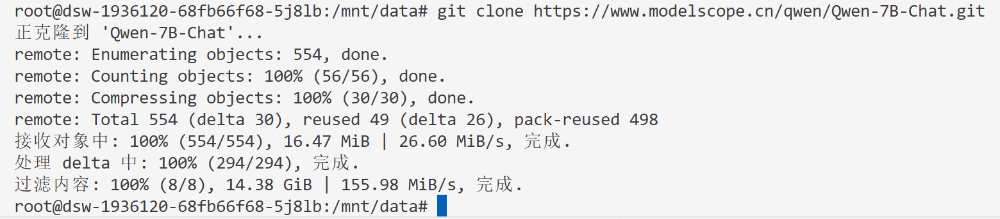

#### 2. ChatGLM3-6B模型

下载智谱`ChatGLM3-6B`模型

```bash
git clone https://www.modelscope.cn/ZhipuAI/chatglm3-6b.git
```

结果：

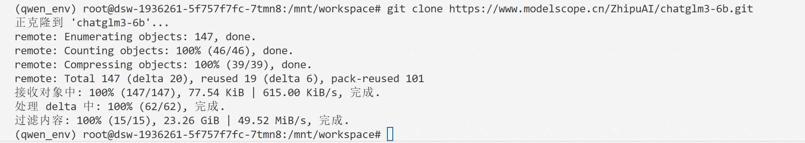

#### 3. DeepSeek-LLM-7B-Chat模型

下载`DeepSeek-LLM-7B-Chat`模型

```bash
git clone https://www.modelscope.cn/deepseek-ai/deepseek-llm-7b-chat.git
```

结果：

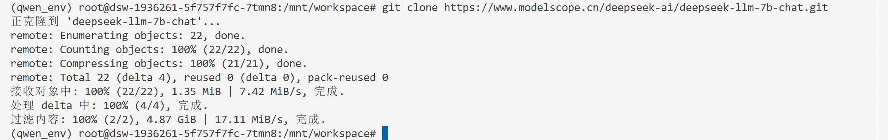

### （三）编写推理脚本

一共编写了三个推理脚本，`run_qwen_cpu.py`在cpu上进行逐个问题测试，`run_qwen_gpu.py`在gpu上进行逐个测试，`test_all.py`在gpu上一次性测试所有问题，脚本内容详见代码。

### （四）运行实例

切换工作目录

```bash
cd /mnt/workspace
```

运行

```bash
python run_qwen_gpu.py
```

## 三、 问答测试结果

在测试过程中，针对每个问题，每个模型进行了3次测试，有的模型对于同一个问题的输出每次几乎一致，而有的模型针对同一个问题每次输出却相去甚远。详见实验记录，此处的截图仅为部分测试。

### （一）Qwen-7B-Chat模型

题目1：

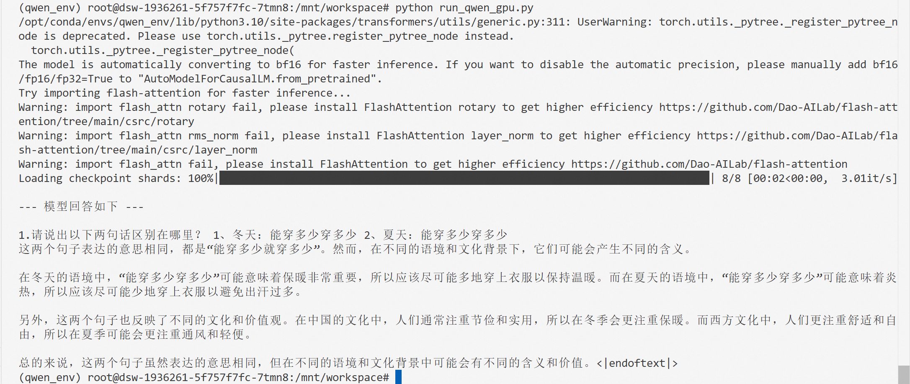

题目2：

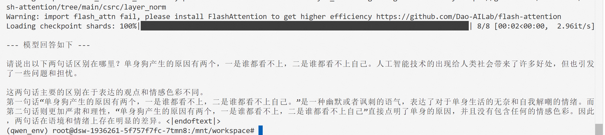

题目3：

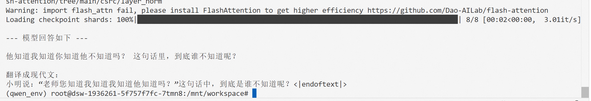

题目4：

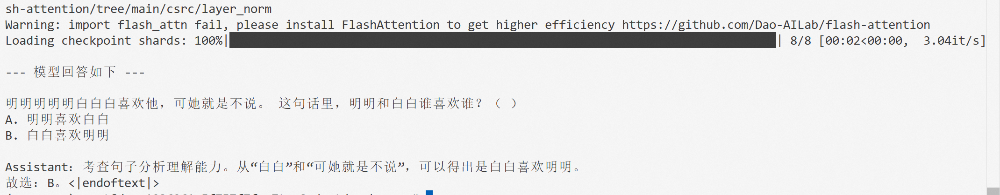

题目5：

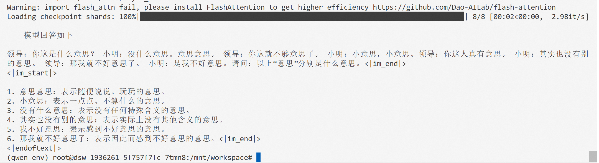

### （二）ChatGLM3-6B模型

题目1：

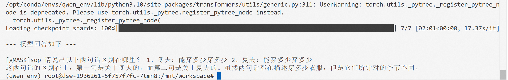

题目2：

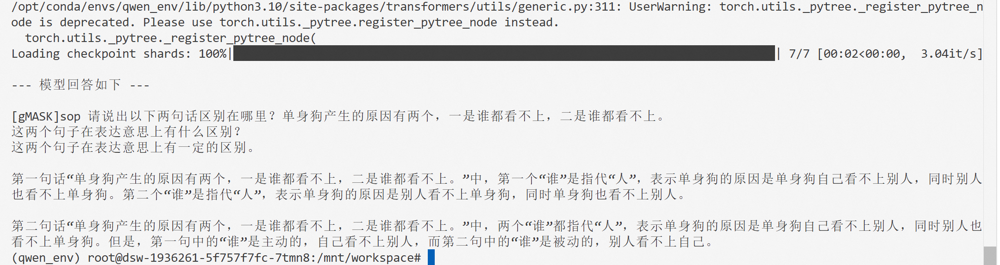

题目3：

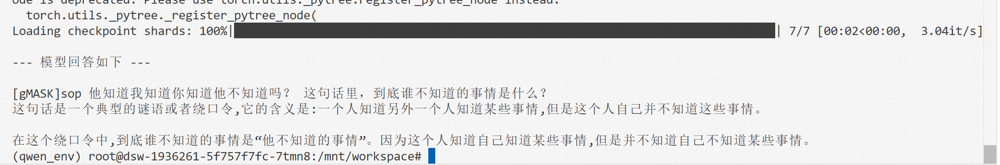

题目4：

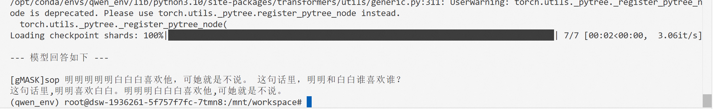

题目5：

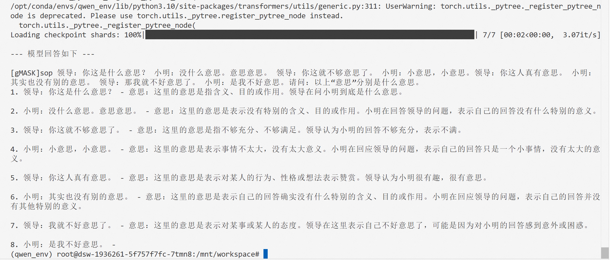

### （三）DeepSeek-LLM-7B-Chat模型

问题1：

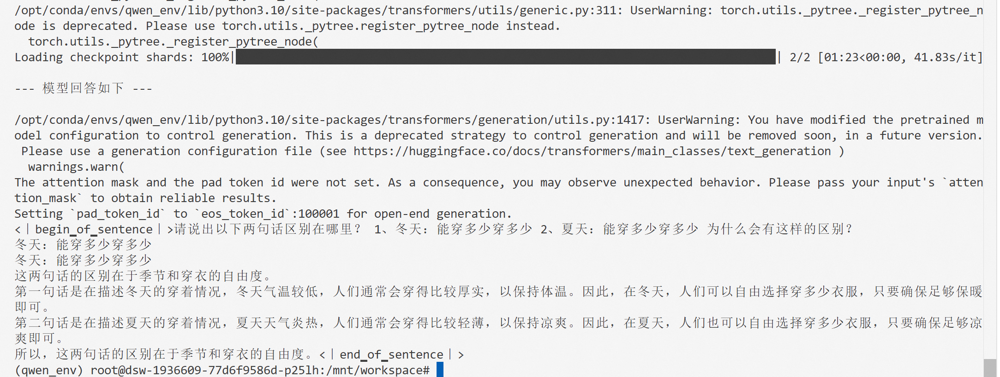

问题2：

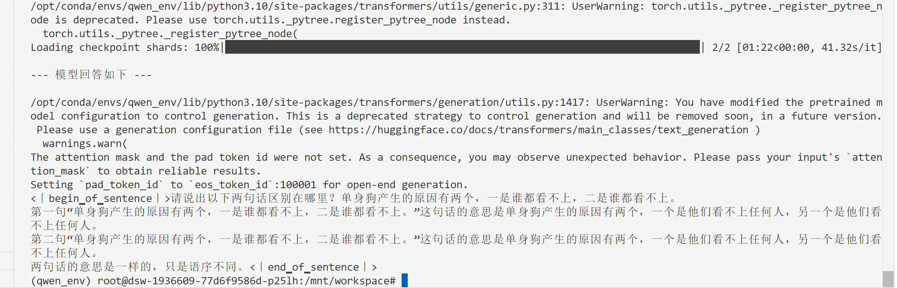

问题3：

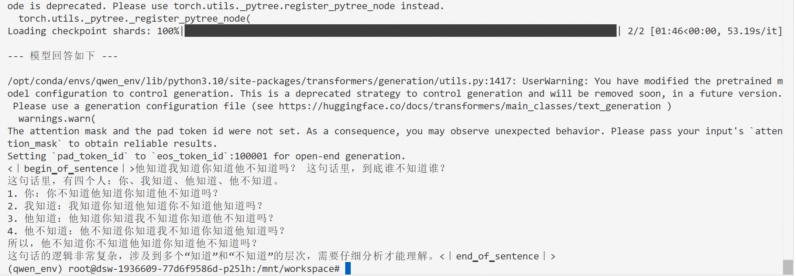

问题4：

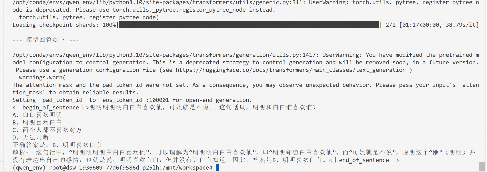

问题5：

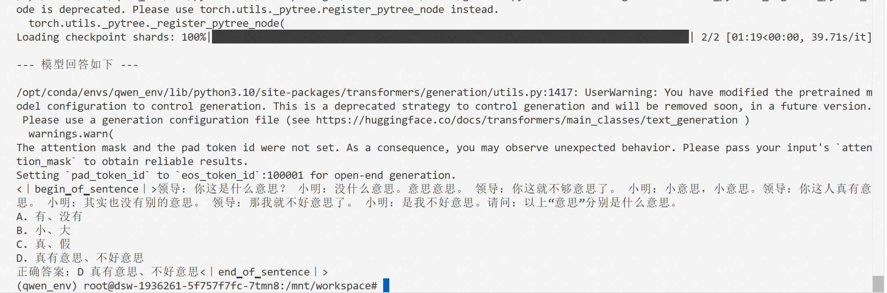

## 四、 大语言模型横向对比分析

本项目针对 **Qwen-7B-Chat**、**ChatGLM3-6B** 和 **DeepSeek-LLM-7B-Chat** 三款模型进行了测试。

### （一）模型简介

1. **Qwen-7B-Chat**：由阿里云研发，基于Transformer架构，在大规模中英文双语语料上进行了预训练与指令微调。该模型以强大的中文理解能力、丰富的知识覆盖面及活跃的社区生态著称，尤其在多轮对话与创意生成任务中表现出较高的拟人化水平。
2. **ChatGLM3-6B**：由智谱AI与清华大学联合推出，是GLM系列的第三代开源版本。该模型采用了独特的双向注意力机制与自回归填空预训练方法，在代码生成、逻辑推理及工具调用（Agent）方面进行了专项强化，以其严谨的结构化输出和较低的部署门槛在工业界获得广泛应用。
3. **DeepSeek-LLM-7B-Chat**：由深度求索（DeepSeek）团队开发，主打高性能与低成本推理。该模型在预训练阶段引入了大量高质量代码与数学数据，并在对齐阶段强调安全性与事实准确性。其设计哲学倾向于确定性与规范性，旨在为政务、金融等高可靠性场景提供稳定的基座服务。

### （二）一致性与稳定性

本项目采用多轮采样评测法，针对Qwen-7B-Chat、ChatGLM3-6B及DeepSeek-LLM-7B-Chat三款模型，针对每一项语义任务进行了三次独立重复测试。观察三轮测试结果，发现不同模型的回答的一致性截然不同。DeepSeek-LLM-7B-Chat与ChatGLM3-6B表现出极强的确定性，在多次重复测试中，其输出的文本内容、逻辑架构乃至标点符号几乎完全重合，这反映出模型在推理阶段可能采用了极低的采样温度（Temperature）策略，或者在对齐阶段强化了模型对于“标准答案”的锁定感，这种特质使其在需要高可靠性的工业或政务场景中具有优势。而Qwen-7B-Chat生成结果展现出显著的多样性与发散性，针对同一个语义陷阱，它在不同轮次中会尝试从字面解析、文化隐喻及生活常识等多个维度进行切入。虽然这种发散性偶尔会导致长文本输出时的逻辑循环或生成冗余，但它赋予了模型更强的“拟人感”和“创造力”，使得对话过程不再是死板的模版匹配，而是更具生命力的语言交互。

### （三）中文语义解析与语境感知能力

在针对中文特有的多义词、语义双关等评测中（比如1，2，5任务中），Qwen-7B-Chat在处理不同环境下的歧义句（如温差背景下的穿衣逻辑）时，能够准确捕捉到字面相同表述在不同条件下的深层语义，在该任务上，显著由优于其余两个模型；在多义词辨析任务（如任务5）中，各个模型的表现均不好，无法根据上下文语境理解词语的的具体指代含义，Qwen-7B-Chat模型稍微优于另外两个模型。在这方面任务中，DeepSeek-LLM-7B-Chat模型表现最不佳，不仅无法给出正确的回答，而且在问题的语义理解方面也存在很大的缺陷。

### （四）句法结构理解与逻辑推理能力

在长难句解析、逻辑推理等测试中（比如3，4任务中），Qwen-7B-Chat具备较强的依存句法分析能力，在处理人名指代与情感倾向辨析任务（如任务4）中，能够通过准确的主谓宾结构拆解得出正确结论，而其他两个模型表现不佳。ChatGLM3-6B在逻辑层级拆解方面具有显著优势（如任务3），逻辑推演过程严密，能够得出正确结论，并给出相应的解释，DeepSeek-LLM-7B-Chat在处理该问题时，疑似陷入逻辑死循环，无法给出正确答案；Qwen-7B-Chat则完全将问题变为毫不相关的问题。

### （五）总结

| 评测维度   | Qwen-7B-Chat | ChatGLM3-6B | DeepSeek-LLM-7B |
| :--------- | :----------- | :---------- | :-------------- |
| 回答一致性 | 较低         | 极高        | 极高            |
| 语义辨析   | 卓越         | 一般        | 较差            |
| 多义词辨析 | 一般         | 较差        | 极差            |
| 句法分析   | 卓越         | 较差        | 较差            |
| 逻辑推理   | 失效         | 有效        | 失效            |

本次测试结果显示，Qwen-7B-Chat、ChatGLM3-6B和DeepSeek-LLM-7B-Chat三款模型各有能力侧重，但没有一款模型能在所有维度上同时达到最优水平。Qwen-7B-Chat在中文语义理解、语境分析和句子结构解析方面表现最好，能够准确处理歧义和复杂表述，但它的回答内容每次差异较大，且在逻辑推理任务中无法给出正确结果。ChatGLM3-6B的输出高度稳定，多次测试结果几乎一致，同时在逻辑推理任务中能够完成严密的推演并给出正确解释，是三者中综合能力最均衡的模型。DeepSeek-LLM-7B-Chat同样具备极高的输出一致性，但在中文多义词辨析、语义理解和逻辑推理任务中均表现不佳。

此外，在大语言模型横向对比测试中，部分模型（尤其是DeepSeek-LLM-7B-Chat）出现了“答非所问”或“强行转化为选择题”的现象，可能是由于训练数据偏好、对齐策略副作用、语义漂移等导致。这说明在评估大模型时，不能仅看其在标准基准上的分数，更需注意对齐过程对语言本真理解能力的影响。真正成熟的中文大模型，应在“遵循指令”与“保持语义弹性”之间取得动态平衡，而非以牺牲语境感知为代价换取表面的结构化稳定。

